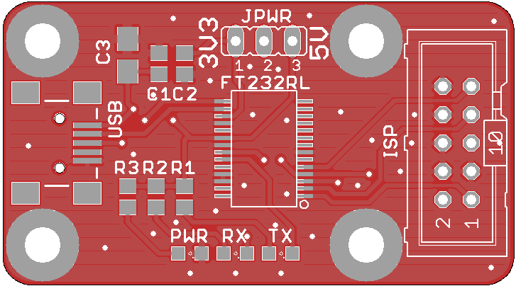

# ESP8266 programmer

This is part of [mqopen](http://mqopen.org) project.

## Features

 - Board dimensions: 1800 x 1000 mils (45.72 x 25.4 mm).
 - FT232RL chip.
 - Connected using mini USB socket (4 legs SMD).
 - PWR, RX and TX LEDs.
 - 10 pin AVR like header for programming ribbon cable.

## Get board

You can order PCB on this [link](http://dirtypcbs.com/view.php?share=20024&accesskey=b40cd2f50915caacdd38e3f2a6016732).
